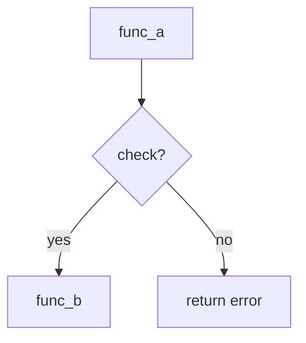
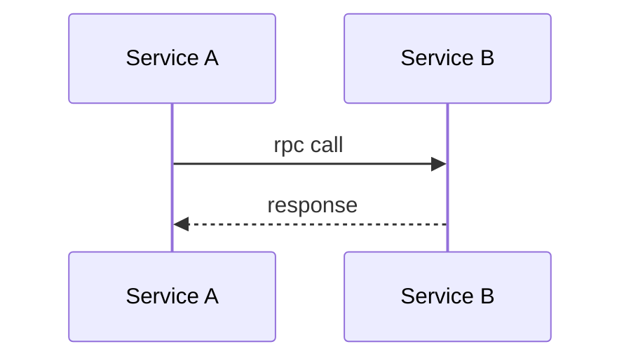

# Skill: code-diagram

从代码符号（函数/模块/struct）自动生成技术图，支持 PlantUML / Mermaid / WaveDrom。提供调用链追踪、功能清单、变更影响、代码审查等分析模式。

**触发命令**：`/code-diagram [模式] [目标]`

### 目标

成为一个**语言无关、框架自适应**的软件项目分析工具——不需要手动配置，自动理解项目结构并生成可操作的技术洞察。

具体做到：

1. **零配置** — `--init` 一条命令完成项目检测，不需要写配置文件
2. **全量发现** — 不手选函数列表，不依赖命名约定，不硬编码项目特定的类型/前缀/模式
3. **自适应** — 遇到新语言/新框架时从源码中学习项目的类型系统、注册模式、模块边界
4. **可操作输出** — 不只是数据转储；每条 finding 附带具体的 fix 建议和行动优先级
5. **自我进化** — 每次算法失败记录到 Heuristics，下次执行时避开已知陷阱

---

## Quick Start

```
/code-diagram --init                           # 自动检测项目 → 生成 .code-diagram.json
/code-diagram --index                          # 构建源码索引（首次必须）
/code-diagram --tree <函数名>                    # 调用链树
/code-diagram -t activity <函数名>              # 活动图 (SVG+PNG)
/code-diagram --features                       # 功能清单 (5 表)
/code-diagram --review                         # 代码审查 (HTML 报告)
/code-diagram --impact <符号>                   # 变更影响分析
```

`--init` 自动识别语言/构建系统/框架/模块结构，生成项目配置文件。首次使用只需这两步：`--init` → `--index`。

---

## 概述

本 skill 扫描源码目录构建轻量调用图索引，然后按需生成技术图或分析报告。

支持的**语言**：C / C++ / Python / Go / Rust / Java（通过文件扩展名和构建系统自动检测）

支持的**项目类型**：嵌入式固件 / REST 服务 / CLI 工具 / 库 / 多语言 monorepo

支持的**分析模式**：

| 模式 | 命令 | 输出 |
|------|------|------|
| 调用链追踪 | `--tree <func>` | 缩进树 + 通信标注 |
| 功能清单 | `--features` | 5 表 (Module/Feature/Switches/Products/IRQ) |
| 代码审查 | `--review` | HTML 报告 + Grade + Fix 建议 |
| 变更影响 | `--impact <symbol>` | 反向依赖树 + 影响等级 |
| 错误传播 | `--error-path <func>` | 错误产生→上报→SOC 路径 |
| 图生成 | `-t <type> <target>` | .puml/.mmd/.wave → SVG + PNG |

---

## Project Auto-Detection（--init）

`--init` 扫描项目目录，自动检测所有配置项，生成 `.code-diagram.json` 放在项目根目录。后续命令读取此文件，无需手动配置。

### 检测项目

| 维度 | 检测方式 | 示例 |
|------|---------|------|
| **语言** | 文件扩展名统计 (>.c=60%→C) | C (C11), Python (3.10+), Go (1.21+) |
| **构建系统** | Makefile / CMakeLists.txt / go.mod / Cargo.toml / pyproject.toml | CMake + Makefile.cmake |
| **源码目录** | src/ lib/ drivers/ cmd/ pkg/ | drivers/, product/, common/ |
| **测试目录** | test/ tests/ spec/ *_test.* | 未检测到 |
| **框架** | RTOS API / Flask / Gin / Rocket / Spring | Bare-metal embedded |
| **模块划分** | 目录边界 → 自动分组 | 6 个模块 (drivers/mainband, drivers/sideband, ...) |
| **开关/特性** | `#ifdef` / `#[cfg]` / `@feature` / build tags | 20 个 #define switches |
| **错误模型** | `sys_error_*` / `panic!` / `log.Fatal` / `raise` | sys_error_save() → DOORBELL |
| **并发模型** | ISR / goroutine / async/await / threads | ISR + main loop |

### 生成的配置

```json
{
  "project": "my-project",
  "language": "C",
  "build_system": "cmake",
  "framework": "bare-metal",
  "source_dirs": ["drivers/", "product/", "common/"],
  "modules": { ... },
  "preset": "embedded-firmware"
}
```

`preset` 字段决定加载哪些检查规则和语义标注。内置 preset：`embedded-firmware` / `rest-service` / `cli-tool` / `library`。preset 不存在时使用 `general` 默认规则。

---

## 执行模式

### Step 1 — 解析输入

```
/code-diagram [模式] [选项] [目标]

模式 (互斥，未指定时自动判断):
  --init               项目自动检测 + 配置生成
  --index              构建/重建源码索引
  --tree <func>        调用链树
  --features [子系统]   功能清单
  --review             代码审查 (HTML 报告)
  --filetree            文件结构树 (含每个文件的主要作用)
  --impact <symbol>    变更影响分析
  --error-path <func>  错误传播追踪
  -t <type> <target>   生成指定类型的技术图

选项:
  --product <name>    产品/变体过滤 (多产品项目)
  --compact           紧凑风格 (节点 >30 推荐)
  --mermaid/--puml/--wavedrom  强制工具选择
  --html              HTML 报告 (默认 .md)
  --no-cache          强制慢扫描 (grep 源码, 忽略索引)
  --no-png            跳过 PNG 导出
  --help/-h           用法速查
```

**图类型** (`-t`)：

| 参数 | 图类型 | 适用场景 |
|------|--------|---------|
| `-t activity` / `a` | 活动图 | 函数调用链、分支/轮询/错误路径 |
| `-t sequence` / `seq` | 时序图 | 多角色跨层/跨服务消息交互 |
| `-t state` / `st` | 状态图 | 状态机迁移 |
| `-t component` / `arch` | 组件图 | 模块分层架构 |
| `-t seq-box` / `sb` | 序列+泳道 | 协议栈分层路径 |
| `-t er` / `entity` | ER 图 | struct/数据模型嵌套关系 |
| `-t flow` / `f` | 流程图 | 纯决策树 |
| `-t timing` / `wave` | 时序波形 | 时序/握手/IRQ (WaveDrom) |

### Step 2 — 追踪调用链

从目标函数开始，递归追踪 call graph。

**深度规则**：
- 项目内部函数：最多展开 3 层
- 框架/驱动函数：展开到关键 API 调用为止
- 外部/标准库函数：不展开，作为叶节点

**通信模式标注**（根据 preset 自动启用）：

| Flow | 含义 | 颜色 | C 项目对应 | Go 项目对应 |
|------|------|------|-----------|------------|
| `mmio` | 寄存器读写 | `#2563eb` | `mmio_read_32` | — |
| `mailbox` | 命令/消息 | `#7c3aed` | MSG 寄存器 | `channel.Send` |
| `rpc` | 跨服务调用 | `#059669` | Sideband | `grpc.Invoke` |
| `data` | 数据通路 | `#ea580c` | DMA | `io.Copy` |
| `irq` | 中断/信号 | `#dc2626` | ISR | `signal.Notify` |
| `db` | 数据库 | `#0891b2` | — | `db.Query` |
| `state` | 状态迁移 | `#6b7280` | State machine | FSM |

> 非 C 项目：`mmio`/`mailbox`/`sideband`/`mainband`/`dma` → 替换为 `rpc`/`db`/`http`/`event`/`queue`

### Step 3 — 结构提取

生成 PUML/图之前，先输出调用链树作为 checkpoint：

```
调用链树（缩进表示层级）:
  cmd_clci_link()
  ├── _link_common_cfg()          [mailbox]
  │   ├── REMOTE_DIE_RESET        [mailbox → FW]
  │   └── LOCAL_DIE_RESET         [mailbox → FW]
  ├── _sp_lane_cfg()              [mmio]
  └── _link_start()               [mailbox → CMD_CLCI_LINK]
      └── sep1_link()
          ├── clci_bitlock()       [mmio 轮询]
          ├── clci_pcslock()       [mmio 轮询]
          └── Doorbell → SOC      [irq]

分支: bitlock OK/FAIL, pcslock OK/FAIL
循环: bitlock 轮询 (repeat-while), pcslock 轮询 (repeat-while)
通信: mmio(4) + mailbox(3) + irq(1)
```

### Step 4-8 — 布局→风格→生成→验证→导出

与当前 PlantUML/Mermaid 8 步工作流相同（参见 [附录 A](#附录-a-plantuml-8-步工作流)）。

---

## Project Index（项目索引）

`--index` 扫描源码目录构建轻量 JSON 索引。后续 `--tree` / `--features` / `--review` 读索引走快路径（O(1)，毫秒级），索引不存在时回退 grep（秒级，不退化）。

索引文件：项目根目录下的 `code-diagram/<project-name>.json`

### 索引内容

```json
{
  "project": "my-project", "language": "C", "framework": "bare-metal",
  "modules": { "mainband": {...}, "sideband": {...} },
  "call_graph": { "func_a": {"callees":["b"], "callers":["x","y"], "file":"src/a.c:42"} },
  "cli_commands": [ {"name":"link", "handler":"do_link", "desc":"link <dev>..."} ],
  "public_apis": ["clci_link", "clci_reset", "clci_get_reg"],
  "feature_switches": { "FEATURE_X": {"default":1, "comm":"mainband"} },
  "file_hashes": { "src/main.c": "sha256:abc123..." }
}
```

> `--index` 做**全量发现**（非手选列表）：所有非 static 函数默认入库、`add_command()` 注册提取、`clci_*` 前缀自动识别为公共 API。读取 `.code-diagram.json` 的模块列表作为起点。

### 缓存策略

```
--index:    全量扫描 → 构建索引 → 计算 SHA256 hashes
默认:      索引存在 + hash 未变 → 快路径 (读 JSON, 毫秒)
           索引不存在或过期 → 慢路径 (grep, 秒)
--no-cache: 强制慢路径 (grep 源码, 忽略索引) — 用于索引可疑时验证
```

---

## Feature Inventory（功能清单）

`--features` 横向扫描项目，全量发现所有功能点，聚合为模块级功能清单、开关宏、中断路由、产品差异。

### 发现方法（项目自适应，无硬编码）

#### 1. 函数全量发现

不依赖任何命名约定或前缀。扫描所有源码文件，用**项目自身的类型系统**匹配函数定义：

```
1. 扫描 #include / import / typedef → 提取项目类型词表 (s32, u32, MyType, etc.)
2. 用类型词表构建正则: TYPE_RE = (void|int|{type1}|{type2}|...)
3. 全量匹配函数定义 → 入库
4. 分类: 文件顶层 + !static → public, static → private
```

#### 2. 模块边界检测

```
1. 读取 --init 的 modules 配置
2. 无配置时: 目录边界 = 模块边界 (每个一级子目录为一个模块)
3. 统计每个模块的 public/private 函数数
```

#### 3. CLI 命令发现

不是硬编码 `add_command` 正则——而是**检测项目的命令注册模式**：

```
1. 扫描源码，寻找 "字符串→函数指针" 的注册调用模式
2. C/C++: add_command / REGISTER_CMD / CLI_COMMAND / command_register
3. Go:    cobra.Command{Use: "name", Run: handler}
4. Python: @click.command / @cli.command / argparse.add_parser
5. Java:  @Command(name="...") / picocli
6. 通用: 任意 func("literal_string", handler_func, "desc") 模式
7. 提取: 命令名 / handler / 描述 / 文件位置
```

#### 4. 公共 API 发现

不依赖命名前缀——用**可见性+位置**推断：

```
1. 非 static / 非 private → candidate
2. 位于核心目录 (drv/ / lib/ / src/ / pkg/) → 加分
3. 不在 test/ demo/ example/ → 加分
4. 被其他模块的 ≥2 个函数调用 → 确认公共 API
5. 评分排序, top N 标记为 public API
```

#### 5. 开关/Feature Flag 发现

```
C/C++:    #define / #ifdef / #if 条件编译
Go:       go build -tags / +build 注释
Python:   @feature_flag / os.environ / config module
Rust:     #[cfg(feature = "...")]
通用:     扫描项目配置文件 (config.h / settings.py / .env / application.yml)
```

#### 6. 产品/变体发现

```
1. 检测 --init 的 "多产品" 信号 (product/ / variants/ / flavors/ 目录)
2. 对每个变体目录, 提取配置差异 (config.h / build.gradle / Cargo.toml [features])
3. 构建差异矩阵
```

### 输出

默认生成 Markdown 报告 (项目根目录下的 `code-diagram/features-report.md`)，`--html` 生成 HTML 交互报告。

**5 表**：Module Overview / Feature Detail (CLI commands + APIs 全量) / Feature Switches / Product Variance / Interrupt/Event Routing。

---

## Code Review & Risk Assessment（审查与风险评估）

`--review` 基于索引和启发式模式匹配做快速自查。**不需要编译、不需要外部工具**。参考 clang static analyzer 和 cppcheck 的检查逻辑，但仅依赖索引和源码正则匹配。

### 13 项检查

#### 通用检查（R1-R2, R5, R7-R14 — 所有 preset 启用）

| # | 检查项 | 方法 | 参考工具 |
|---|--------|------|----------|
| **R1** | 返回值未检查 | 函数返回 error 但 caller 无判断 | — |
| **R2** | 高 blast radius | caller 数 ≥5 | — |
| **R5** | 错误未上报 | 错误路径无 error report 调用 | — |
| **R7** | 深调用链 | depth ≥4 | — |
| **R8** | 函数指针/接口绑定点 | fp/interface 仅在单产品实现 | — |
| **R9** | 错误路径资源泄漏 | 比对 `goto fail_*` 回滚链是否按逆序释放了每个已分配资源；检测 alloc 和 free 之间是否有路径跳过释放 | cppcheck `memleak` |
| **R10** | alloc/free 配对不匹配 | `devm_kzalloc` 不应手动 `kfree`；`dma_alloc_coherent` 不应调 `kfree`；检测分配/释放函数类型不匹配 | cppcheck `mismatchAllocDealloc` |
| **R11** | 空指针解引用 | 可能返回 NULL 的函数（`dma_alloc_coherent`, `dma_request_channel` 等），caller 未检查直接解引用；或 `IS_ERR()` 检查之后仍使用错误指针 | clang `core.NullDereference` |
| **R12** | 重复释放 | 同一资源在多个 `fail_*` 标签路径中被释放；或 `fail_*` 回滚链中释放顺序与分配顺序不一致 | cppcheck `doubleFree` |
| **R13** | 不可达代码 | `return`/`stop`/`detach`/`goto` 之后的代码是否可达；`goto` 标签之间是否有"落入"死代码 | clang `deadcode.DeadStores` |
| **R14** | 无符号与负数比较 | `u32`/`size_t`/`unsigned int` 等无符号类型与 `< 0` 或 `>= 0` 比较 — 条件永假或永真 | cppcheck `unsignedLessThanZero` |
| **R15** | 未初始化变量使用 | 局部变量声明时未赋初值、在赋值前被使用；struct 字段在所有初始化路径中未显式设值 | clang `core.uninitialized.*` / cppcheck `uninitvar` |

> **R15 已知误报模式：**
> - `unsigned long flags;` + `spin_lock_irqsave(&lock, flags)` — `flags` 通过宏传引用初始化，语法上不出现 `flags =`
> - `struct *p = devm_kzalloc(sizeof(*p));` — 整个 struct 被零初始化，字段默认值为 0/NULL
> - 检测时跳过这些模式；仅报告赋值路径上确实无初始化的变量

#### embedded-firmware 专属检查（R3, R4, R6）

| # | 检查项 | 方法 | 参考工具 |
|---|--------|------|----------|
| **R3** | 轮询无 timeout | 循环体内无超时检查 | — |
| **R4** | 固定地址 struct | struct 含 HW 地址注释/固定偏移 | — |
| **R6** | ISR/Handler 为 polling | 中断 handler 存在但配置为轮询 | — |

> `rest-service` preset 替换 R3→连接池耗尽、R4→SQL 注入风险、R6→graceful shutdown 缺失。R9→未关闭连接/文件句柄, R10→连接泄漏, R12→重复 close。

### 输出

默认生成 Markdown 报告 (项目根目录下的 `code-diagram/review-report.md`)，`--html` 生成 HTML 交互报告。内容：Grade + 风险计数、各检查详情 + Fix 建议、Action Items。

---

## Change Impact Analysis（变更影响）

`--impact <symbol>` 反向追踪依赖。给定函数/struct/宏 → 列出所有受影响的引用方。

| 影响等级 | 标准 | 示例 |
|---------|------|------|
| 🔴 高 | 固定地址 struct 或 ≥10 caller | `clci_config_t` |
| 🟡 中 | 被 5+ 函数引用、跨模块 | `cfg5.tracking_lane` |
| 🟢 低 | 仅 1-2 引用，无跨层 | `fw_version` |

---

## Error Path Tracing（错误传播）

`--error-path <func>` 追踪错误产生点→上报终点。错误模型由 `--init` 自动检测（C→`sys_error_save`、Go→`return err` 链、Python→`raise` 栈）。

---

## 工具选择

| 工具 | 适用场景 | 输出 |
|------|---------|------|
| **PlantUML** | 源码链接、复杂泳道、正式文档 | `.puml` → SVG + PNG |
| **Mermaid** | 轻量、≤15 节点、文档内嵌 | `.mmd` / Markdown 代码块 |
| **WaveDrom** | 时序波形、并行信号对齐 | `.wave` → SVG |

详见 [附录 C: PlantUML/Mermaid/WaveDrom 模板](#附录-c-模板参考)。

---

## 风格文件

| 文件 | 用途 |
|------|------|
| `styles/code-diagram-default.puml` | 标准风格 skinparam |
| `styles/code-diagram-compact.puml` | 紧凑风格 (节点 >30) |
| `styles/code-diagram-semantic.puml` | 语义箭头宏 + 形状宏 |

---

## 附录 A: PlantUML 8 步工作流

### Step 4 — 布局规划

| 因素 | 决策 | 规则 |
|------|------|------|
| 节点数 | 是否分页 | ≤20 单页, 20-40 partition 分组, >40 分页 |
| 跨模块通信 | partition 分组 | box 区分不同模块/服务 |
| 轮询循环 | repeat-while | 固件模式：repeat-while 标注寄存器名 |
| 错误路径 | 分离/内联 | 关键错误路径内联，次要聚合到 note |

### Step 5 — 风格加载

```plantuml
@startuml
!include <skill-dir>/styles/code-diagram-default.puml
title [函数名] 流程\n([所在文件路径])
```

### Step 6 — 生成 PlantUML 代码

#### 源码链接格式

```plantuml
:[[/api/source?file=path/to/file.c&line=N 函数名()]];
```

#### 固件常用模板

**超时轮询**：
```plantuml
repeat
  :读寄存器 REG_NAME;
  if (目标位 == 期望值?) then (yes)
    :break;
  else (no)
  endif
  if (timeout++) then (超时)
    :return error;
    detach
  endif
repeat while (继续等待) is (未完成)
```

**无限主循环**：
```plantuml
while (firmware running) is (∞)
  :任务1;
endwhile
```

**条件分支**：
```plantuml
if (条件?) then (yes)
  :处理 A;
else (no)
  :处理 B;
endif
```

#### 常见模式

| 代码模式 | 图中表示 |
|---------|---------|
| `while (1) { ... }` | `while (...) is (∞) ... endwhile` |
| `if (timeout++ > N) return ERROR` | repeat-until + detach |
| 函数指针调用 | 注明 "产品特定实现" + 链接 to init |

### Step 7 — 验证

```bash
bash <skill-dir>/scripts/validate-diagram.sh file.puml
```

6 项自动检查：PlantUML 语法 / 源码链接完整 / 寄存器命名 / 产品差异 / 可读性 / SVG XML。

### Step 8 — 渲染与导出

```bash
bash <skill-dir>/scripts/export-diagram.sh file.puml -w 1920
```

`plantuml -tsvg` → `cairosvg scale=2` → 降级 `rsvg-convert`。

---

## 附录 B: embedded-firmware preset 示例

### preset 配置 (`presets/embedded-firmware.json`)

```json
{
  "name": "embedded-firmware",
  "detect": ["ISR", "mmio_read", "bare-metal", "while(1)"],
  "arrow_semantics": ["mmio","mailbox","sideband","mainband","irq","dma","state"],
  "review_checks": ["R1","R2","R3","R4","R5","R6","R7","R8"],
  "error_model": "sys_error_save(error_class, code)",
  "plantuml_patterns": ["repeat-while","detach","partition"],
  "communication_labels": {
    "mmio": {"color":"#LightBlue","desc":"寄存器读写"},
    "irq":  {"color":"#FFE4E4","desc":"中断/ISR"},
    "mailbox":{"color":"#EDE9FE","desc":"命令/响应"},
    "sideband":{"color":"#FEF3C7","desc":"跨 Die 消息"},
    "mainband":{"color":"#FFEDD5","desc":"数据通路"}
  }
}
```

> 领域专用示例见私有仓库 `Brody888/code-diagram-examples`（CLCI embedded-firmware 等）。通用示例见 README。

---

## 附录 C: 模板参考

### Mermaid 模板





### WaveDrom 模板

```wavedrom
{signal: [
  {name: "clk",  wave: "p......"},
  {name: "data", wave: "01....."},
]}
```

---

## Algorithm Heuristics（算法避坑经验）

执行中发现的错误模式，记录于此防止重复。每次算法失败 → 写入此节 → 下次执行时检查。

### 函数发现

| # | 陷阱 | 症状 | 根因 | 正确做法 |
|---|------|------|------|---------|
| H1 | **正则交替爆炸** | 0 matches | `(type1|type2|...|type80)` 超过 regex 引擎内部限制 | 类型 ≤30 个；或两步法：宽松匹配→集合查表 |
| H2 | **懒惰量词丢字符** | 类型只匹配首字母 | `(\w[\w\s]+?)` 非贪婪只取最短——`s32 func()` 的返回类型被截为 `s` | 用贪婪匹配然后 `split()` 取最后一段 |
| H3 | **两步法过度松弛** | 3 万+ 误报 | `任何word word(` 匹配了 `INFO(`, `Copyright(`, 宏调用 | 必须加 `{` 验证：函数定义后紧跟 `{` |
| H4 | **头文件重复** | 同一函数出现多次 | `.h` 声明和 `.c` 定义都被计入 | 优先 `.c`；`.h` 中只有无对应 `.c` 的 inline 函数才计入 |
| H5 | **typedef 全部纳入** | 类型词表含 486 个系统类型 | 把系统头文件的 `typedef` 也扫进来了 | 只纳入**在函数签名中实际出现**的 typedef |
| H5b | **toolchain 目录污染** | `end()`/`size()` 等 STL 函数被当成项目代码 | 扫描了 `platform/mcu/rv32imac/` — GCC toolchain + C++ STL headers | 排除 toolchain 路径：`*/lib/gcc/*`, `*/include/c++/*`, `*/plugin/include/*`, `*/mcu/*/lib/*` |

### 公共 API 检测

| # | 陷阱 | 症状 | 根因 | 正确做法 |
|---|------|------|------|---------|
| H6 | **命名前缀硬编码** | 换项目后 0 API | `clci_*` 只在 CLCI 有效 | 位置评分：核心目录 + 非 static = 候选；前缀自适应检测 |
| H7 | **评分阈值单一** | 嵌入式项目 API 太少 / 应用项目 API 太多 | 不同项目类型 API 密度不同 | 阈值按 framework 自适应（bare-metal 2, SDK 3, REST service 4） |

### CLI 命令检测

| # | 陷阱 | 症状 | 根因 | 正确做法 |
|---|------|------|------|---------|
| H8 | **单一模式漏检** | 只匹配到 `add_command` | 不同框架用不同注册方式 | 多模式并行扫描；新项目首次运行后报告匹配到的模式 |

### 索引构建

| # | 陷阱 | 症状 | 根因 | 正确做法 |
|---|------|------|------|---------|
| H9 | **手选函数列表** | 新项目只索引 13 个函数 | 初期用 `key_funcs = [...]` 偷懒 | 全量发现是唯一正确方式；手选列表仅限调试 |
| H10 | **`--init` 孤岛** | `--init` 检测了 974 函数但 `--index` 没用 | 两套独立的扫描逻辑 | `--index` 必须读取 `.code-diagram.json` 的模块列表 |

### PlantUML 活动图生成

| # | 陷阱 | 症状 | 根因 | 正确做法 |
|---|------|------|------|---------|
| H11 | **`;#Color>` 后缀吞噬 `if`** | `Error: Cannot find if` — `if` 在 `:text;#Color>` 之后被解析器忽略 | PlantUML 1.2026.2 parser bug：`;#` token 使后续 `if` / `note right` 关键字被错误解析为活动文本的一部分 | 1) 不在紧邻 `if` 或 `note right` 的节点上使用 `;#Color>` 后缀；2) 在 `note right` 中用 `[mmio]`/`[irq]`/`[dma]` 标注通信模式代替节点着色；3) `:#Color>text;` 前缀语法不触发 bug 但颜色实际未生效，不可用 |
| H12 | **空 `else` 分支** | PlantUML 拒绝解析带空 `else` 的 if 块 | PlantUML activity diagram 不允许 `else` 分支中无任何节点 | 无 else 动作时省略 `else` 子句，直接 `if (cond?) then (yes) :act; endif` |

### 验证脚本

| # | 陷阱 | 症状 | 根因 | 正确做法 |
|---|------|------|------|---------|
| H13 | **step_count 包含非链接节点** | Source Link 覆盖率虚低（46%） | `grep '^\s*:.*;$'` 计入所有活动节点，包括 `fail_*` 回滚标签、`return`/`stop`/`goto` 等不需要源码链接的节点 | 修正 step_count 统计：排除 `fail_*`、`goto`、`return`、`stop` 行；阈值从固定 80% 改为按节点类型分级（逻辑步骤 ≥80%，标签节点不计） |

### 配置生成

| # | 陷阱 | 症状 | 根因 | 正确做法 |
|---|------|------|------|---------|
| H14 | **非标准 preset 名** | `.code-diagram.json` 写入 `"preset": "linux-kernel-driver"` 但无对应 preset 定义 | `--init` 直接将检测到的框架名写入 preset 字段，未在已知 preset 表中查找 | 添加 preset 回退链：1) 在 `[embedded-firmware, rest-service, cli-tool, library]` 中关键词匹配；2) 无匹配 → `"general"`；3) 写入 `"preset_source": "detected framework 'linux-kernel-driver', fallback to general"` |

### 上报与进化

每次 `/code-diagram --features` 或 `--index` 执行失败（函数数 < 预期 50% 或 API 数 = 0），自动检查上表 H1-H14，将匹配到的修复写入对应逻辑。

H11-H12 在每次生成 `.puml` 时检查；H13 在验证脚本中自动应用；H14 在 `--init` 时检查。

---

## 输出目录

所有产物放在项目根目录的 `code-diagram/` 下：

```
<项目根>/
├── .code-diagram.json          # --init 生成的配置
└── code-diagram/
    ├── <project>.json           # --index 的索引
    ├── filetree.md              # --filetree 文件结构报告
    ├── features-report.md       # --features 报告 (--html → .html)
    ├── review-report.md         # --review 报告 (--html → .html)
    └── *.puml / *.svg / *.png   # -t 生成的图
```

## 参考

- `/code-diagram --help` — 用法速查
- `scripts/` — 验证/导出/审查脚本
- `styles/` — PlantUML 风格文件
